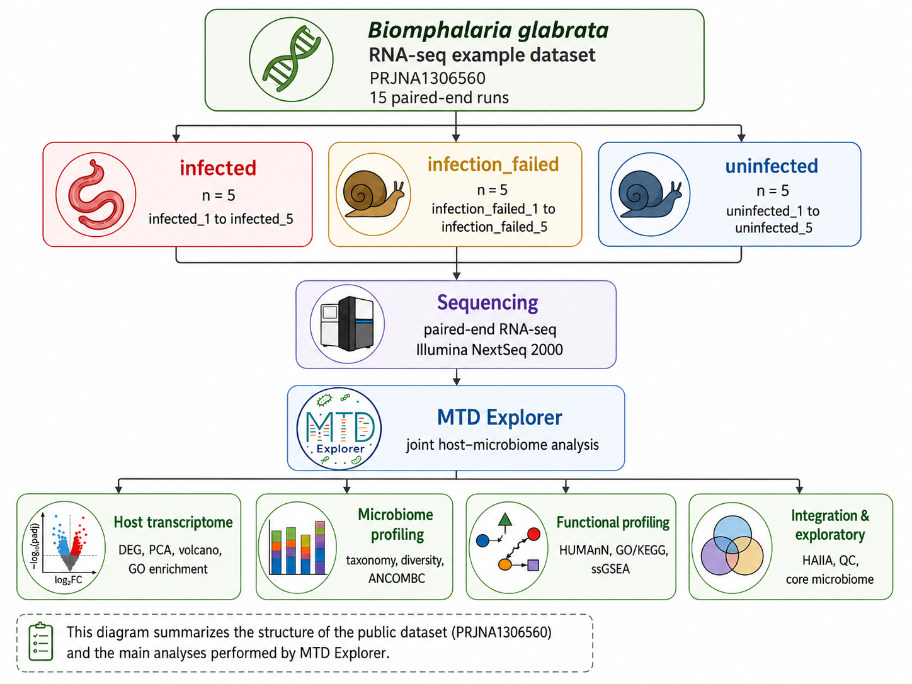

# Example dataset: *Biomphalaria glabrata* (PRJNA1306560)

The example figures shown throughout the [MTD Explorer][mtd-explorer]
documentation were generated from publicly available RNA-seq data deposited in
the [NCBI Sequence Read Archive][ncbi-sra] under
[BioProject PRJNA1306560][bioproject].

Using a single public dataset across the documentation makes the examples
traceable and reproducible while demonstrating host transcriptomic,
microbiome, functional, exploratory, and host–microbiome integration analyses
within the same biological system.

!!! info "Dataset overview"

    **Organism:** [*Biomphalaria glabrata*][ncbi-taxonomy]  
    **NCBI Taxonomy ID:** 6526  
    **BioProject:** [PRJNA1306560][bioproject]  
    **SRA Study:** [SRP609141][sra-study]  
    **BioSample:** [SAMN50639599][biosample]  
    **Submitting institution:** Queen's University Belfast  
    **Sequencing strategy:** RNA-Seq  
    **Library source:** Transcriptomic  
    **Library layout:** Paired-end  
    **Sequencing platform:** Illumina NextSeq 2000  
    **Number of SRA runs:** 15  
    **Public release:** 15 August 2025

## Biological context

[*Biomphalaria glabrata*][ncbi-taxonomy] is a freshwater gastropod mollusc and
an important intermediate host of *Schistosoma mansoni*, the parasitic
trematode responsible for intestinal schistosomiasis.

The *B. glabrata*–*S. mansoni* interaction is a widely studied host–parasite
system. Following parasite exposure, compatible snails can support
intramolluscan parasite development and ultimately release cercariae capable
of infecting a vertebrate host. Infection outcome can therefore provide a
useful biological framework for investigating host responses and
host-associated microbial communities.

Because genomic and transcriptomic resources are available for
*B. glabrata*, this system is also well suited to the joint host-transcriptome
and microbiome analyses performed by MTD Explorer.


### Host–parasite system

<div id="example-dataset-organisms" style="display:grid; grid-template-columns:repeat(auto-fit,minmax(300px,1fr)); gap:1.5rem; align-items:start; margin:1.5rem 0;">

<figure style="margin:0; text-align:center;">
  
  <figcaption style="margin-top:0.7rem; font-size:0.88em;">
    <strong><em>Biomphalaria glabrata</em></strong><br>
    Dissected snail showing primary sporocysts of <em>Schistosoma mansoni</em>
    (arrows); scale bar = 1 mm.<br>
    Source: Lima et al. (2019),
    <a href="https://doi.org/10.3389/fimmu.2019.00328">
      <em>Frontiers in Immunology</em> 10:328
    </a>.
    <a href="https://creativecommons.org/licenses/by/4.0/">
      CC BY 4.0
    </a>.
  </figcaption>
</figure>

<figure style="margin:0; text-align:center;">
  
  <figcaption style="margin-top:0.7rem; font-size:0.88em;">
    <strong><em>Schistosoma mansoni</em></strong><br>
    Paired adult worms shown by light microscopy; scale bar = 1 mm.<br>
    Source: Mitsui, Miura &amp; Kato (2020),
    <a href="https://doi.org/10.1186/s41182-020-00230-x">
      <em>Tropical Medicine and Health</em> 48:42
    </a>.
    <a href="https://creativecommons.org/licenses/by/4.0/">
      CC BY 4.0
    </a>.
  </figcaption>
</figure>

</div>

<p style="font-size:0.82em; margin-top:-0.5rem;">
  These images provide independent biological context for the
  <em>B. glabrata</em>-<em>S. mansoni</em> system and are not images from
  BioProject PRJNA1306560.
</p>

## Experimental structure

The public dataset contains **15 paired-end RNA-seq runs**, divided equally
among three deposited library groups:

| Group | Number of runs | Library names |
| --- | ---: | --- |
| `infected` | 5 | `infected_1` – `infected_5` |
| `infection_failed` | 5 | `infection_failed_1` – `infection_failed_5` |
| `uninfected` | 5 | `uninfected_1` – `uninfected_5` |
| **Total** | **15** | |

The SRA accessions span:

```text
SRR35002006 – SRR35002020
```


A simplified representation of the dataset used in the documentation is shown below:



*PRJNA1306560 example dataset workflow.* Overview of the 15 paired-end RNA-seq
runs, the three deposited library groups, and the major MTD Explorer analysis
layers illustrated throughout this documentation.

## Sample metadata

All 15 runs are associated in the deposited SRA metadata with the BioSample
[SAMN50639599][biosample], whose sample name is `Snail_rna_seq`.

The experimental identities used by MTD Explorer are therefore derived from
the deposited library names:

```text
infected
infection_failed
uninfected
```

MTD Explorer preserves these labels rather than attempting to reinterpret the
experimental classifications assigned by the data submitters.

!!! note "About the `infection_failed` label"

    The public SRA metadata use `infection_failed` as one of the library-group
    labels. The deposited RunInfo metadata do not define the exact biological
    criterion used to assign this outcome.

    For this reason, the MTD Explorer documentation retains the original label
    without interpreting it as a specific mechanism such as resistance or
    susceptibility.

## How the dataset is used in this documentation

The complete MTD Explorer run contains all three experimental groups.

For concise examples of pairwise differential analysis, the documentation
primarily displays:

```text
infected_vs_uninfected
```

Other analyses use the complete three-group dataset where appropriate.

The dataset is used to illustrate outputs from:

- host gene-expression analysis;
- microbiome taxonomic profiling;
- differential microbiome analysis;
- functional profiling;
- ssGSEA;
- HAllA host–microbiome integration;
- taxonomic exploratory analysis;
- alpha and beta diversity;
- core microbiome analysis;
- taxonomic composition and abundance;
- microbiome quality-control summaries.

The example figures therefore provide a consistent view of the different MTD
Explorer result layers using one public RNA-seq dataset.

## Publication status

The SRA RunInfo metadata for **PRJNA1306560 / SRP609141** do not report an
associated PubMed identifier.

At the time this page was prepared, no peer-reviewed publication could be
unambiguously linked to PRJNA1306560 through the accession itself.

A 2025 doctoral thesis from [Queen's University Belfast][qub-thesis],
*From taxa to transcripts: investigating the snail holobiont in the context
of helminth infection*, investigates the *Biomphalaria glabrata*–
*Schistosoma mansoni* system, the snail-associated microbiome, and multi-omic
approaches including transcriptomics.

However, the publicly available thesis record does not explicitly identify
PRJNA1306560. It is therefore presented here only as **related scientific
context**, not as a confirmed publication associated with this BioProject.

## Interpretation of the documentation figures

!!! important "Example outputs, not original study results"

    Figures displayed in the MTD Explorer documentation were generated by
    **MTD Explorer from the public sequencing data**.

    They are intended to demonstrate pipeline behavior, analysis modules,
    output organization, and visualization types.

    Unless independently supported by the original study metadata or a linked
    publication, these figures should not be interpreted as reproducing the
    original investigators' statistical analyses or biological conclusions.

## Reproducibility

Users wishing to reproduce these examples should retrieve the original
sequencing reads together with the associated SRA metadata so that public
accession numbers and deposited experimental labels remain traceable.

The principal public identifiers are:

| Resource | Accession |
| --- | --- |
| NCBI BioProject | [PRJNA1306560][bioproject] |
| SRA Study | [SRP609141][sra-study] |
| BioSample | [SAMN50639599][biosample] |
| NCBI Taxonomy | [6526][ncbi-taxonomy] |
| SRA runs | SRR35002006–SRR35002020 |

## Related documentation

- [Pipeline benchmarking](benchmarking.md)
- [Output files](output-files.md)
- [Host expression outputs](host-expression-outputs.md)
- [Microbiome comparison outputs](microbiome-comparison-outputs.md)
- [Functional profiling outputs](functional-profiling-outputs.md)
- [ssGSEA outputs](ssgsea-outputs.md)
- [HAllA integration outputs](halla-integration-outputs.md)
- [Taxonomic exploratory outputs](taxonomic-exploratory-outputs.md)
- [Taxonomic visualizations](taxonomic-visualizations.md)
- [Methods and reproducibility outputs](methods-reproducibility-outputs.md)

[mtd-explorer]: https://github.com/patrick-douglas/MTD-Explorer
[ncbi-sra]: https://www.ncbi.nlm.nih.gov/sra
[bioproject]: https://www.ncbi.nlm.nih.gov/bioproject/PRJNA1306560
[sra-study]: https://www.ncbi.nlm.nih.gov/sra/?term=SRP609141
[biosample]: https://www.ncbi.nlm.nih.gov/biosample/SAMN50639599
[ncbi-taxonomy]: https://www.ncbi.nlm.nih.gov/Taxonomy/Browser/wwwtax.cgi?id=6526
[qub-thesis]: https://pure.qub.ac.uk/en/studentTheses/from-taxa-to-transcripts-investigating-the-snail-holobiont-in-the/
