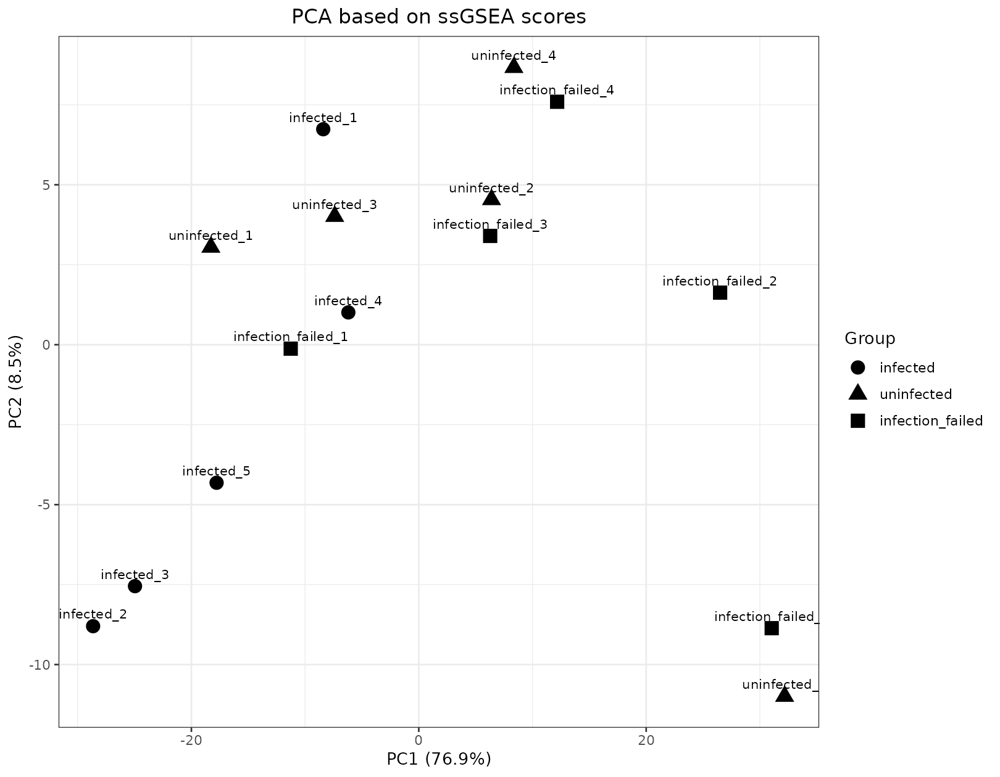
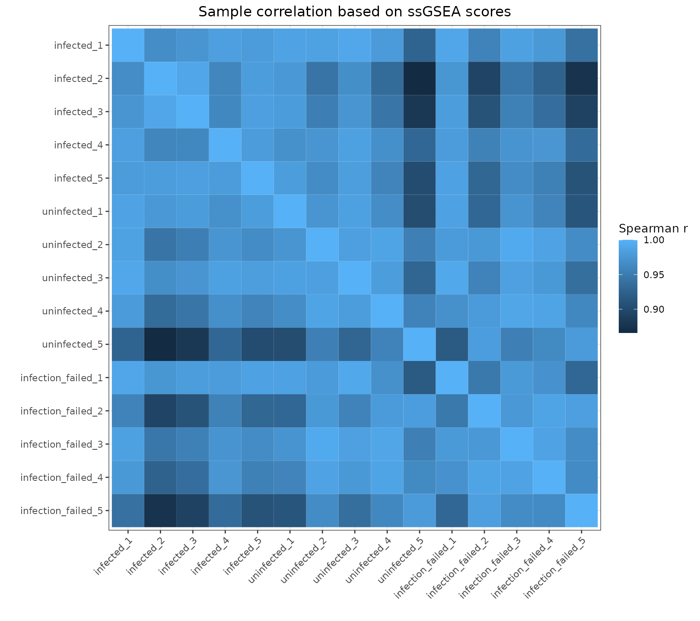
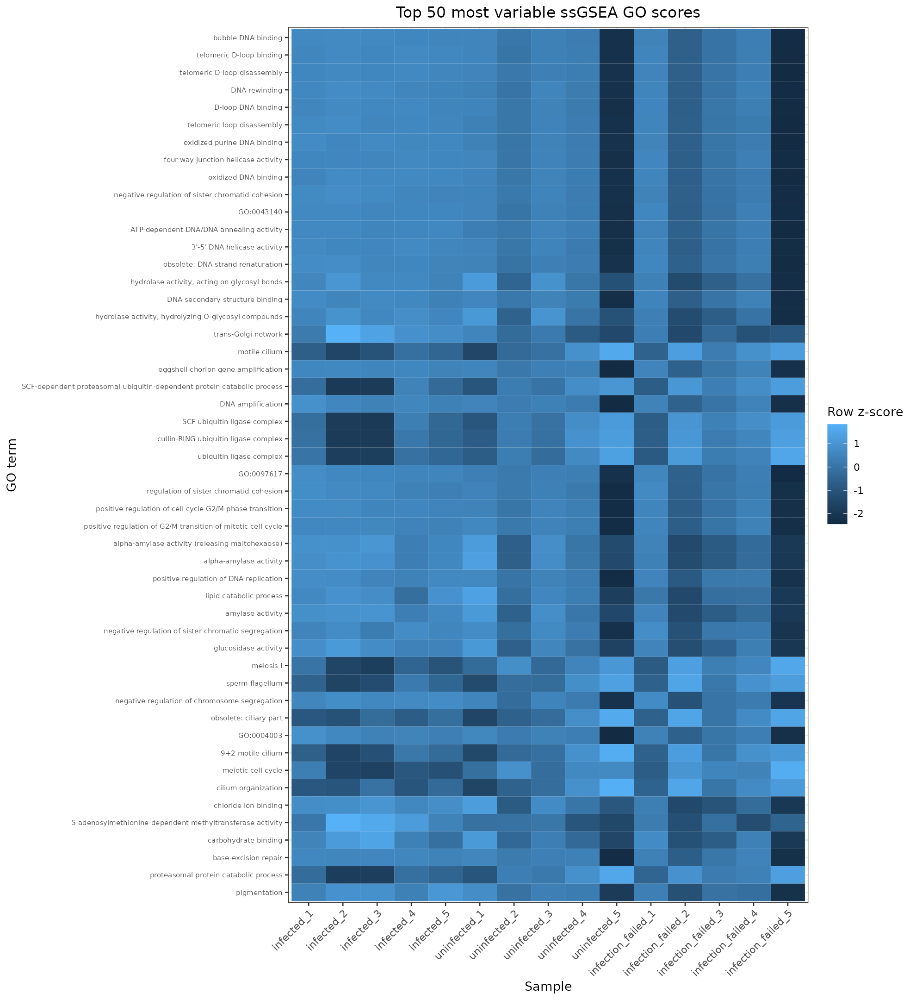
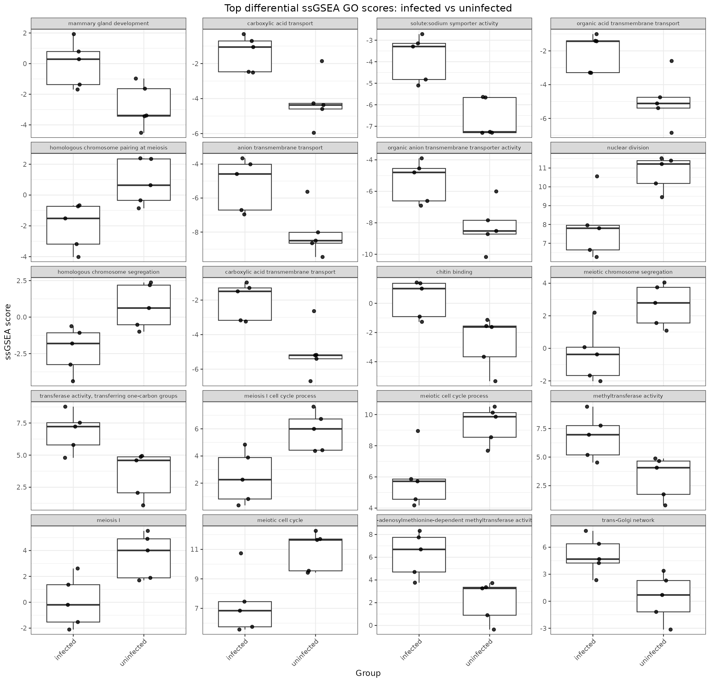

# ssGSEA outputs

This page describes the single-sample gene set enrichment outputs generated by
[MTD Explorer][mtd-explorer].

[ssGSEA][ssgsea] summarizes host gene-set activity at the sample level. In MTD
Explorer, ssGSEA runs in comparison-capable analyses after the host expression
matrix has been converted to `ssGSEA/host.gct`.


!!! info "Documentation example dataset"

    Figures shown on this page were generated from public *Biomphalaria glabrata*
    RNA-seq data from NCBI BioProject
    [PRJNA1306560](https://www.ncbi.nlm.nih.gov/bioproject/PRJNA1306560).
    The example run contains `infected`, `infection_failed`, and `uninfected`
    groups. Pairwise comparison examples use `infected_vs_uninfected` where
    applicable.

## Current GMT selection behavior

The current default is:

```text
--ssgsea-gmt auto
```

This is different from the earlier legacy behavior in which the bundled MSigDB
C2 symbols GMT was the default.

Available modes are:

| Value | Behavior |
|---|---|
| `auto` | **Current default.** Use the persistent eggNOG/GO master GMT created by `Create_custom_host.sh` for the selected host TaxID, intersect it with the current `host.gct`, and filter the resulting sets for this analysis |
| `default` | Explicitly use the bundled legacy MSigDB C2 symbols GMT |
| `FILE` | Use an existing user-provided GMT directly |

`custom_eggnog` is retained only as a deprecated backward-compatible alias and
is internally converted to `auto`.

!!! important "Requirement for auto mode"

    The selected host reference must contain the persistent master GMT generated
    by `Create_custom_host.sh`. If that file is missing, `auto` mode stops with
    an error rather than silently falling back to MSigDB.

## Analysis-specific GMT in auto mode

With `auto`, MTD Explorer does not rerun eggNOG annotation during every analysis.
It starts from the persistent host-reference master GMT and creates an
analysis-specific GMT after `host.gct` is available.

The generated files are stored under:

```text
ssGSEA/custom_gmt_from_host_reference/
```

For host TaxID `TAXID`, the directory contains files such as:

```text
custom_taxid_TAXID_eggNOG_GO.gmt
custom_taxid_TAXID_eggNOG_GO_analysis_summary.tsv
custom_taxid_TAXID_eggNOG_GO_analysis_set_table.tsv
```

The default filtering settings are:

| Filter | Current value |
|---|---:|
| Minimum genes per retained set | `5` |
| Maximum genes per retained set | `500` |
| Minimum overlap genes | `100` |
| Minimum overlap percentage | `1` |

The analysis-specific GMT is the file actually supplied to ssGSEA in `auto`
mode. The methods table records the requested GMT setting, the resolved mode,
the persistent master GMT, and the analysis-specific GMT.

## Main ssGSEA files

The core files are stored under:

```text
ssGSEA/
```

Important files include:

```text
ssGSEA/host.gct
ssGSEA/ssgsea-results-scores.gct
```

`host.gct` is generated from the host TPM matrix and the samplesheet.
`ssgsea-results-scores.gct` contains the sample-level enrichment scores produced
by the ssGSEA implementation.

## Original-feature plots

Plots using the original ssGSEA feature labels or GO IDs are stored in:

```text
ssGSEA/plots/
```

Typical outputs include:

```text
ssGSEA/plots/ssGSEA_PCA_samples.png
ssGSEA/plots/ssGSEA_sample_correlation_heatmap.png
ssGSEA/plots/ssGSEA_top_variable_heatmap.png
ssGSEA/plots/ssGSEA_plot_summary.txt
```

Equivalent PDF versions may also be produced for supported plots.

## GO-name-corrected plots

MTD Explorer also attempts to create a second set of plots with readable GO
names. These are stored in:

```text
ssGSEA/plots_GO_names/
```

The corrected score matrix and GO-resolution records include:

```text
ssGSEA/ssgsea-results-scores_GO_names_corrected.gct
ssGSEA/go_term_resolution/ssGSEA_GO_ID_to_name_map.tsv
ssGSEA/go_term_resolution/quickgo_cache.tsv
```

The resolver first uses local information and supported correction mappings. By
default, unresolved terms may also use the online QuickGO fallback and a
secondary-ID/replacement search when internet access is available.

Typical corrected plots include:

```text
ssGSEA/plots_GO_names/ssGSEA_PCA_samples.png
ssGSEA/plots_GO_names/ssGSEA_sample_correlation_heatmap.png
ssGSEA/plots_GO_names/ssGSEA_top_variable_heatmap.png
```

## ssGSEA PCA

The PCA summarizes similarity among samples using the most variable ssGSEA
features selected for the ordination.

Typical files are:

```text
ssGSEA/plots/ssGSEA_PCA_samples.png
ssGSEA/plots_GO_names/ssGSEA_PCA_samples.png
```



Samples that cluster near one another have more similar pathway/activity
profiles. PCA is exploratory and should be interpreted together with the study
design and differential score tables.

## Sample correlation heatmap

Typical files are:

```text
ssGSEA/plots/ssGSEA_sample_correlation_heatmap.png
ssGSEA/plots_GO_names/ssGSEA_sample_correlation_heatmap.png
```



These heatmaps summarize sample-to-sample similarity across the ssGSEA score
matrix.

## Top-variable heatmap

Typical files are:

```text
ssGSEA/plots/ssGSEA_top_variable_heatmap.png
ssGSEA/plots_GO_names/ssGSEA_top_variable_heatmap.png
```



The plot highlights gene sets with the greatest variation across samples. It is
useful for descriptive inspection but is not a substitute for formal group
comparison.

## Differential ssGSEA comparisons

Differential ssGSEA is now comparison-aware and supports studies with more than
two groups.

When the samplesheet contains explicit `group1` and `group2` comparison columns,
those valid pairs are used. If no explicit comparison pairs are available, the
plotting workflow automatically generates all pairwise combinations among the
matched sample groups.

The comparison plan is written to:

```text
ssGSEA/plots/ssGSEA_differential_comparisons.tsv
```

and separately in the GO-name directory when the corrected plots are enabled.

The combined differential results are written to:

```text
ssGSEA/plots/ssGSEA_differential_scores.tsv
```

For multiple contrasts, each comparison also receives a numbered directory:

```text
ssGSEA/plots/differential/01_GROUP1_vs_GROUP2/
ssGSEA/plots/differential/02_GROUP1_vs_GROUP3/
```

Each contrast can contain:

```text
ssGSEA_differential_scores.tsv
ssGSEA_top_differential_boxplots.png
ssGSEA_top_differential_boxplots.pdf
```

The same structure is generated under `plots_GO_names/` for the corrected GO
labels.

The differential table records the comparison index/name/source, group labels,
sample counts, group means, the group1-minus-group2 difference, t-test and
Wilcoxon p-values, and Benjamini-Hochberg-adjusted values. Multiple-testing
adjustment is performed within each biological contrast across the tested
terms.

When only one contrast exists, the workflow also preserves the convenient
backward-compatible top-level differential boxplot in the plot directory.

## Fewer than two groups

If fewer than two usable groups are available for the plotting step, formal
ssGSEA differential testing is skipped rather than fabricating a contrast. A
marker file is written:

```text
ssGSEA_differential_skipped.txt
```

This is a valid non-differential plotting outcome, not necessarily a pipeline
error.

## Top differential boxplots

For each valid contrast, the top differential boxplots visualize selected
pathways/gene sets across the two groups.



Use the corresponding `ssGSEA_differential_scores.tsv` table for statistical
interpretation rather than reading significance from the figure alone.

## Recommended inspection order

For a current run, inspect:

```text
ssGSEA/host.gct
ssGSEA/ssgsea-results-scores.gct
ssGSEA/custom_gmt_from_host_reference/          # when --ssgsea-gmt auto
ssGSEA/plots/ssGSEA_plot_summary.txt
ssGSEA/plots/ssGSEA_PCA_samples.png
ssGSEA/plots/ssGSEA_sample_correlation_heatmap.png
ssGSEA/plots/ssGSEA_top_variable_heatmap.png
ssGSEA/plots/ssGSEA_differential_comparisons.tsv
ssGSEA/plots/ssGSEA_differential_scores.tsv
ssGSEA/plots/differential/
ssGSEA/go_term_resolution/
ssGSEA/plots_GO_names/
methods/mtd_methods_run_parameters.csv
```

Not every item is present in every run. The custom GMT directory is specific to
`auto`, differential files require usable groups, and GO-name files depend on
the GO-name plotting step.

## What these outputs can support

ssGSEA outputs can help assess whether host gene-set activity profiles cluster
by sample or group, which pathways are most variable, and which pathway scores
show statistical differences in defined biological contrasts.

## What not to conclude

Do not interpret PCA separation or heatmap clustering as formal evidence of a
group effect.

Do not assume the legacy MSigDB C2 GMT was used unless the run explicitly
requested `--ssgsea-gmt default` or the methods table confirms that mode.

Do not compare ssGSEA scores across runs without checking the GMT source,
analysis-specific filtering, host reference, expression preprocessing, and
samples included in each run.

## When outputs may be missing

ssGSEA is skipped in exploratory/no-comparison pipeline runs. Individual plots
or differential files may also be absent when there are too few samples,
insufficient score variation, fewer than two usable groups, or no valid terms
for a contrast.

## Related pages

- [Custom host references](custom-host-references.md)
- [Command-line reference](command-line.md)
- [Methods and reproducibility outputs](methods-reproducibility-outputs.md)
- [Host expression outputs](host-expression-outputs.md)
- [HAllA integration outputs](halla-integration-outputs.md)

[mtd-explorer]: https://github.com/patrick-douglas/MTD-Explorer
[ssgsea]: https://gsea-msigdb.github.io/ssGSEA-gpmodule/v10/
